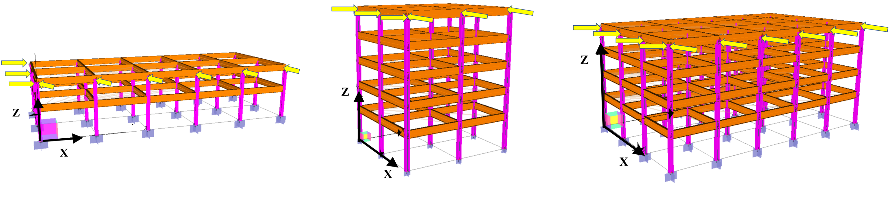

# Structural-Analysis-with-Graph-Neural-Networks

In this paper, a rapid surrogate is developed for structural analysis using graph neural networks. A novel and compact graph representation conforming to the structural connectivities is proposed. Graph neural networks (GNN) and message-passing mechanisms are utilized to handle the interactions between stories and structural elements. A structural graph neural network (StructGNN) framework is developed, which contains a dynamic number of message-passing layers. The rigid slab constraint is embodied within the message-passing layers, making message propagation more efficient and realistic. After training with random-shaped structures and random-valued lateral forces, the StructGNN model accurately predicts the distribution of forces and deformations and exhibits high generalizability to taller, unseen structures. With high interpretability in its message-passing mechanism and high-speed computation with GPU parallelism, StructGNN is a fast alternative to traditional structural analysis. It has a high potential to solve more complex structural engineering problems.

### Data
The data includes 2000 linear static analysis responses for 2-6 story structures and 500 linear static analysis responses for 7-9 story structures. Each analysis data is packaged as a `graph.pt` where the structure geometries and responses for each node are saved in this pytorch object.

### StructGNN model
StructGNN model is composed of an encoder, message-passing layers, and a decoder. The number of the message-passing layer varies with the story number of the structure. Structures with `N` story will go through `N+1` message-passing layers to ensure the external force information applied on the roof is passed through the entire graph.

### Results
After training, StructGNN can predict responses in 2-6 story structures with over 99% in displacement, shear force, and bending moment. In addition, when testing on 7-9 story structures, which are taller and the model has never seen before, StrcutGNN can still have 95% of accuracy.

We further visualized the node embedding propagation in each stage of the message-passing layers. If we don't use the mechanism that the layer number will vary with the structure's story number, the performance is not as good, since using a fixed number of message-passing layers can either be too much for a relatively short structure, or too few for a tall structure. The embeddings of using a fixed number message-passing layer are visualized below.

By using the dynamic number of message-passing layers, the features of the external forces can be propagated to the entire structure properly, making it even generalizable on taller, unseen structures.

